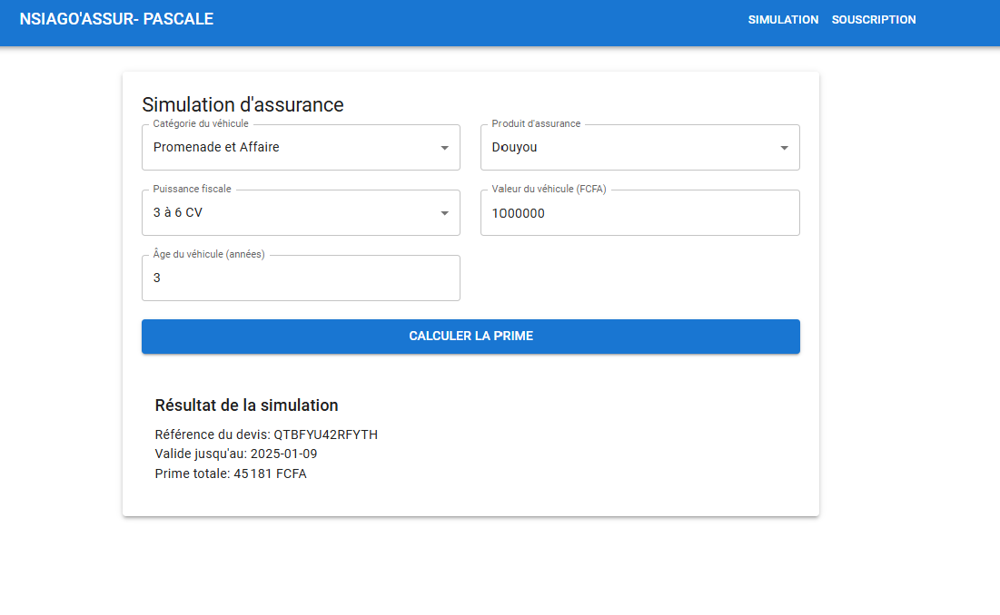

# NSIAGO'ASSUR Frontend

Application web de gestion d'assurance automobile permettant aux amazones de générer des revenus complémentaires via la vente de produits d'assurance automobile.

## Captures d'écran

### Page d'Accueil

*Page d'accueil présentant les différents produits d'assurance*

### Simulation

*Interface de simulation de prime d'assurance*

### Souscription

*Étape 1 : Informations du véhicule*


*Étape 2 : Informations de l'assuré*


*Étape 3 : Récapitulatif et confirmation*


## Technologies Utilisées

- React.js 18.2.0
- Material-UI (MUI) 5.14.5
- Formik 2.4.3 (Gestion des formulaires)
- Yup (Validation des formulaires)
- Axios (Appels API)
- React Router DOM 6.15.0

## Installation et Configuration

### 1. Configuration de Git (Important pour Windows)
```bash
# Configurer Git pour la gestion des fins de ligne
git config --global core.autocrlf false
git config --global core.eol lf

# Normaliser les fins de ligne
git add --renormalize .
git commit -m "Normalize line endings"
```

### 2. Installation des Dépendances

```bash
# Installation de Material-UI et ses dépendances
npm install @mui/material @emotion/react @emotion/styled @mui/icons-material

# Installation des autres dépendances
npm install react-router-dom formik yup axios

# Ou installation complète via package.json
npm install
```


### 5. Configuration de l'API
Modifier l'URL de l'API dans `src/services/api.js` :
```javascript
const API_BASE_URL = 'http://localhost:8080/api/v1';
```

## Structure du Projet

```
src/
├── components/
│   ├── insurance/
│   │   ├── Simulation.js    # Composant de simulation d'assurance
│   │   └── Subscription.js  # Composant de souscription d'assurance
│   ├── layout/
│   │   └── Navbar.js        # Barre de navigation
│   └── pages/
│       └── Home.js          # Page d'accueil
├── services/
│   └── api.js              # Services pour les appels API
├── App.js                  # Composant principal
└── index.js               # Point d'entrée de l'application
```

## Fonctionnalités Principales

### 1. Page d'Accueil
- Affichage des produits d'assurance disponibles
- Navigation vers la simulation pour chaque produit
- Produits disponibles :
  - Papillon (RC, DOMMAGE, VOL)
  - Douby (RC, DOMMAGE, TIERCE COLLISION)
  - Douyou (RC, DOMMAGE, COLLISION, INCENDIE)
  - Toutourisquou (Toutes garanties)

### 2. Simulation d'Assurance
- Calcul de prime d'assurance en fonction de :
  - Catégorie du véhicule
  - Produit d'assurance
  - Puissance fiscale
  - Valeur du véhicule
  - Âge du véhicule
- Affichage du résultat avec :
  - Référence du devis
  - Date de validité
  - Prime totale

### 3. Souscription d'Assurance
Processus en 3 étapes :

#### Étape 1 : Informations véhicule
- Date de première mise en circulation
- Numéro d'immatriculation
- Couleur
- Nombre de sièges
- Nombre de portes
- Catégorie

#### Étape 2 : Informations assuré
- Adresse
- Téléphone
- Nom
- Prénom
- Numéro de carte d'identité
- Ville

#### Étape 3 : Récapitulatif
- Résumé des informations saisies
- Confirmation de la souscription
- Génération de l'attestation

## Catégories de Véhicules
- 201 : Promenade et Affaire
- 202 : Véhicules Motorisés à 2 ou 3 roues
- 203 : Transport public de voyage
- 204 : Véhicule de transport avec taximètres

## Calcul des Primes

### Prime de Base (RC)
Basée sur la puissance fiscale :
- 2 CV : 37 601 FCFA
- 3 à 6 CV : 45 181 FCFA
- 7 à 10 CV : 51 078 FCFA
- 11 à 14 CV : 65 677 FCFA
- 15 à 23 CV : 86 456 FCFA
- > 24 CV : 104 143 FCFA

### Garanties Additionnelles
- DOMMAGES (0-5 ans) : 2,60% de la valeur à neuf
- TIERCE COLLISION (0-8 ans) : 1,65% de la valeur à neuf
- TIERCE PLAFONNEE (0-10 ans) : 4,20% de la valeur assurée
- VOL : 0,14% de la valeur vénale
- INCENDIE : 0,15% de la valeur vénale

## Configuration de l'API

Le frontend communique avec une API REST via le service `api.js`. L'URL de base de l'API est configurée dans `src/services/api.js` :

```javascript
const API_BASE_URL = 'http://localhost:9090/api/v1';
```

## Installation et Démarrage

1. Installation des dépendances :
```bash
npm install
```

2. Démarrage en mode développement :
```bash
npm start
```

3. Construction pour la production :
```bash
npm run build
```

## Validation des Données

L'application utilise Yup pour la validation des formulaires avec des règles strictes :
- Validation des dates
- Format d'immatriculation
- Numéros de téléphone
- Nombres de sièges et de portes
- Caractères autorisés pour les noms

## Gestion des Erreurs

- Affichage des messages d'erreur explicites
- Validation en temps réel des champs
- Gestion des erreurs API
- Indicateurs de chargement pendant les soumissions

## Sécurité

- Validation côté client des données
- Protection contre les soumissions multiples
- Gestion sécurisée des tokens et données sensibles
- Validation des types de données

## Interface Responsive

L'application est entièrement responsive grâce à Material-UI :
- Adaptation automatique aux différentes tailles d'écran
- Composants optimisés pour mobile
- Navigation adaptative 

## Résolution des Problèmes Courants

### 1. Erreurs de Fins de Ligne (CRLF/LF)
Si vous rencontrez des avertissements concernant CRLF/LF :
```bash
# Nettoyer l'installation
rd /s /q node_modules
npm cache clean --force

# Réinstaller les dépendances
npm install
```

### 2. Problèmes de Connexion à l'API
- Vérifier que le backend est en cours d'exécution
- Vérifier que l'URL dans `api.js` correspond au backend
- Vérifier les logs dans la console du navigateur (F12)

### 3. Erreurs Material-UI
- Vérifier que toutes les dépendances sont installées
- Vérifier que les polices sont correctement importées
- Vérifier la configuration du thème dans `App.js`

## Déploiement

### 1. Préparation pour la Production
```bash
# Construction de l'application
npm run build

# Test de la version de production
serve -s build
```

### 2. Configuration des Variables d'Environnement
Créer un fichier `.env` à la racine du projet :
```env
REACT_APP_API_URL=http://votre-api-url
```

## Maintenance

### Mise à Jour des Dépendances
```bash
# Vérifier les mises à jour disponibles
npm outdated

# Mettre à jour les dépendances
npm update
```

### Scripts Disponibles
- `npm start` : Démarre l'application en mode développement
- `npm run build` : Construit l'application pour la production

## Support et Contact

Pour toute question ou problème :
1. Consulter la documentation
2. Vérifier les logs de la console
